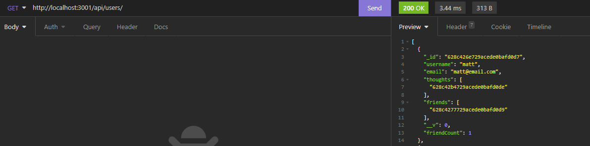

# backend-social-media

## Description
This is the backend for a social media site.  WIth this site, the user is able to add, update, and delete users; add, update, and delete friends; add, update, and delete thoughts; and finally able to post and delete reactions as well.

Although this was one of the easier assignments, it was not without its challenges.  Remembering the syntax and knowing how to use it whether through subdocuments or direct reference was a challenge.   

I did have fun building out the models and seeing them come together.  Back end is something that I have found interesting and this assignment was a great way to challenge myself.

## Contributors
I wrote all of the code, but also received help from my instructor John, TA Michael, and utilized the help of several kind BCS tutors.

## Testing
To use this application, [refer to this video]() for a quick and easy guide.  There is also a screenshot below of what the app should look like in Insomnia when running properly.

## License
Matt Carlson Code, 2022